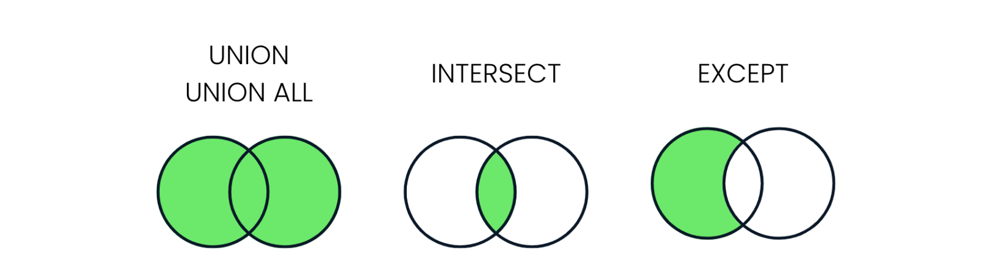

<!--- 
 
 

 &nbsp; 📖 &nbsp; Day N - Something

>  🗓️ &nbsp; Date: 2023-02-N  &nbsp; &nbsp;| &nbsp; &nbsp; 🔖 &nbsp; Resource: [ResourceNAME](Link) 

  
<pre><code>
</code></pre>

---

 ---> 

# Journey of 66 Days of Data

 

 

 

 &nbsp; 📖 &nbsp; Day 1 - The Importance of Data Governance in Organizations 

> 🗓️ &nbsp;  Date: 2023-02-20  &nbsp; &nbsp;| &nbsp; &nbsp; 🔖 &nbsp; Resource: [Learning Data Governance](https://www.linkedin.com/learning-login/share?account=57118729&forceAccount=false&redirect=https%3A%2F%2Fwww.linkedin.com%2Flearning%2Flearning-data-governance-14224082%3Ftrk%3Dshare_ent_url%26shareId%3Dcohrv0OvTo6yI5CniLW7DQ%253D%253D)

In this course on data governance, I learned about the importance of managing data effectively within organizations.
As someone who has taken a course on data governance, I now understand that it involves creating policies, procedures, and standards for managing an organization's data assets. These policies cover a wide range of areas, including data privacy, data quality, data security, and data access.

One key takeaway from the course was the importance of data governance in ensuring the accuracy and reliability of an organization's data. Data governance policies help to ensure that the data is of high quality and can be trusted to support decision-making processes. Additionally, data governance can help organizations comply with regulatory requirements related to data privacy and security.

Overall, this course on data governance has helped me to appreciate the importance of managing data effectively within organizations. By implementing robust data governance policies, organizations can ensure that their data is accurate, secure, and reliable, and that it can be used effectively to support their goals.

___

 
 

 &nbsp; 📖 &nbsp; Day 2 - Advanced Statistical Techniques 

>  🗓️ &nbsp; Date: 2023-02-21  &nbsp; &nbsp;| &nbsp; &nbsp; 🔖 &nbsp; Resource: [Statistics Foundations 4: Advanced Topics](https://www.linkedin.com/learning-login/share?account=57118729&forceAccount=false&redirect=https%3A%2F%2Fwww.linkedin.com%2Flearning%2Fstatistics-foundations-4-advanced-topics%3Ftrk%3Dshare_ent_url%26shareId%3DbgrLh5ABQXy0gFkJrRmHGA%253D%253D)	

In this advanced statistics course, I gained a deeper understanding of various statistical concepts and techniques that are crucial. One of the most significant takeaways from this course was the importance of experimental design in ensuring the validity of statistical inferences. I learned about different types of experimental designs, such as completely randomized, randomized block, and factorial designs, and how to analyze the data obtained from them using analysis of variance (ANOVA). This knowledge is particularly useful in A/B testing. 

Furthermore, the course covered two-population comparisons, where I learned how to compare means and variances of two populations using different statistical tests, such as t-tests and F-tests. Additionally, the course covered advanced topics such as small sample sizes, t-distribution, degrees of freedom, and statistical power.

---

 
 

 &nbsp; 📖 &nbsp; Day 3 - Exploring Analytics Engineering, ETL vs ELT, and dbt for Data Transformation 

>  🗓️ &nbsp; Date: 2023-02-22  &nbsp; &nbsp;| &nbsp; &nbsp; 🔖 &nbsp; Resource: [Fundamentals of Dbt](https://courses.getdbt.com/courses/fundamentals)	

Today, I learned a bit about analytical engineers, ETL vs ELT and dbt for data transformation. I understood the difference between data engineer and analytical engineer. Data Engineers are responsible for designing and maintaining the infrastructure that enables the storage, processing, and analysis of large volumes of data whereas Analytics Engineers focus on building the analytical infrastructure that enables data-driven decision making. 

  

ETL and ELT are two different approaches to building data pipelines. ELT has become more popular in recent years due to the increasing availability of powerful cloud-based data warehouses, such as Amazon Redshift, Google BigQuery, and Snowflake. The main difference between the two approaches is the order in which the transformations are performed. ETL performs transformations on the data before it is loaded into the target system, while ELT loads the data into the target system first and then performs transformations on the data as needed.

dbt (data build tool) is a popular open-source tool that is used to manage data transformation pipelines. It is specifically designed for ELT workflows and provides features such as version control, testing, and documentation for data transformation code. dbt allows analytics engineers to manage the data transformation process in a more scalable and efficient way.

  

Next, I will dive deeper into dbt and explore this powerful too. 

  
---

 
 

 &nbsp; 📖 &nbsp; Day 4 - Diving into dbt fundamentals: A technical overview 

>  🗓️ &nbsp; Date: 2023-02-23  &nbsp; &nbsp;| &nbsp; &nbsp; 🔖 &nbsp; Resource: [Fundamentals of Dbt](https://courses.getdbt.com/courses/fundamentals)	

Today, I learned about data orchestration, fact models, dimension models, and DAG. I also explored the history of data modeling, including the Star schema, Kimball, and Data Vault. I learned that denormalized modeling, agile analytics, and ad hoc analytics are the latest trends in data modeling. I also learned why marts are called marts, and the differences between materialized tables and views.

  

In addition, I learned that models are .sql files that live in the models folder and that modularity is the degree to which a system's components may be separated and recombined. I also explored the concept of Sources, Staging, Intermediate, Fact, and Dimension models. I learned about upstream and downstream dependencies and the importance of data freshness in dbt.

I learned about the importance of modularity in dbt and how it allows for easy separation and recombination of system components. I also learned about the ref macro, which allows for easy reference to other models in the project. Testing is an essential aspect of data transformation, and dbt has features that allow for testing at multiple levels. There are two types of tests in dbt: singular tests and generic tests. Singular tests are specific queries that run on an entire model, while generic tests are written in YAML and run on specific columns in a model.

  
Some of the Terminology

  
| Term | Description |
| --- | --- |
| Analytics Engineering | The process of creating and managing a data pipeline that transforms raw data into actionable insights. |
| ETL | Extract, Transform, Load - a data integration process that extracts data from source systems, transforms it into a format suitable for analysis, and loads it into a data warehouse. |
| ELT | Extract, Load, Transform - a data integration process that extracts data from source systems and loads it into a data warehouse, where it is transformed for analysis. |
| dbt | Data Build Tool - a tool for managing data transformations and orchestrating the data pipeline. |
| Fact Model | A data model that represents a fact or event, such as a sale or a customer interaction. |
| Dimension Model | A data model that represents a person, place, or thing, such as a customer or a product. |
| DAG | Directed Acyclic Graph - a visual representation of the dependencies between data pipeline tasks. |
| Data Vault | A data modeling technique that focuses on auditability, flexibility, and scalability. |
| Materialized Table | A table that is pre-calculated and stored in a database, improving query performance. |
| View | A virtual table that is a result of a query, allowing users to see a specific subset of data without altering the underlying data. |
| Modularity | The degree to which a system's components may be separated and recombined, often with the benefit of flexibility and variety in use. |
| ref Macro | A dbt macro that creates a reference to a model, allowing users to reuse the code and maintain consistency. |
| Source (src) | Raw table data that have been built in the warehouse through a loading process. |
| Staging (stg) | Models that are built directly on top of sources, used for light transformations that shape the data into what you want it to be. |
| Intermediate (int) | Models that exist between final fact and dimension tables, built on staging models rather than directly on sources to leverage the data cleaning that was done in staging. |
| Upstream | Refers to the models that are required to build a specific model. |
| Downstream | Refers to the models that are built on top of a specific model. |
| Freshness | The time since the last time data was refreshed or updated. |
| Singular Tests | Specific queries that are run against a model. |
| Generic Tests | Tests written in YAML that return the number of records that do not meet your assertions. |
| dbt test | A command that runs tests against a model. |
| dbt build | A command that builds the models and prepares them for the data pipeline. |
| Documentation | Information about a model or data pipeline, often in the form of comments or doc blocks. |
| Doc Block | A comment block in dbt that allows users to provide additional context and information about a model or data pipeline. |

  

---

 
 

 &nbsp; 📖 &nbsp; Day 5 - Measures of Spread in Python 

>  🗓️ &nbsp; Date: 2023-02-24  &nbsp; &nbsp;| &nbsp; &nbsp; 🔖 &nbsp; Resource: [Introduction to Statistics in Python](https://app.datacamp.com/learn/courses/introduction-to-statistics-in-python)	

Today I learned about measures of spread such as variance, standard deviation, and mean absolute deviation in Python. These measures help to understand how much the data is spread out from the mean or central tendency.

  

 &nbsp; Variance and Standard Deviation

Variance is the average of the squared differences from the mean, while standard deviation is the square root of variance.

<pre><code>
import numpy as np

data = [2, 4, 6, 8, 10]

var = np.var(data)
std = np.std(data)

print("Variance:", var)
print("Standard Deviation:", std)

## output 
Variance: 8.0
Standard Deviation: 2.8284271247461903

</code></pre>

  

 
 &nbsp; Mean Absolute Deviation 

Mean absolute deviation (MAD) is the average of the absolute differences from the mean.

<pre><code>
import numpy as np

data = [2, 4, 6, 8, 10]

mean = np.mean(data)
mad = np.mean(np.abs(data - mean))

print("Mean Absolute Deviation:", mad)

## output 
Mean Absolute Deviation: 2.4

</code></pre>

 &nbsp; Difference between SD and MSD 
  

The main difference between standard deviation and mean absolute deviation is that the former gives more weight to extreme values in the dataset, whereas the latter treats all deviations equally. Therefore, standard deviation is more sensitive to outliers than mean absolute deviation.

  

 &nbsp; Interquartile Range and Outliers 

Interquartile range (IQR) is the range between the first and third quartiles of the dataset, and it can be used to identify outliers. Any value outside the range of 1.5 times the IQR below the first quartile or above the third quartile is considered an outlier.

<pre><code>
import numpy as np
import scipy.stats as stats

data = [2, 4, 6, 8, 10, 12, 14, 16, 18, 20, 22, 24, 26, 28, 30, 32, 34, 36, 38, 40]

q1, q3 = np.percentile(data, [25, 75])
iqr = q3 - q1

lower_bound = q1 - (1.5 * iqr)
upper_bound = q3 + (1.5 * iqr)

outliers = [x for x in data if x < lower_bound or x > upper_bound]

print("Interquartile Range:", iqr)
print("Outliers:", outliers)

## output 
Interquartile Range: 18.0
Outliers: [2, 40]

</code></pre>

---

 
 

 &nbsp; 📖 &nbsp; Day 6 - Discrete probability and sampling  

>  🗓️ &nbsp; Date: 2023-02-26  &nbsp; &nbsp;| &nbsp; &nbsp; 🔖 &nbsp; Resource: [Datacamp: Random Numbers and Probability](https://campus.datacamp.com/courses/introduction-to-statistics-in-python/random-numbers-and-probability-2?ex=1) , [Youtube playlist: Discrete Probability](https://www.youtube.com/watch?v=oHcrna8Fk18&list=PLvxOuBpazmsNIHP5cz37oOPZx0JKyNszN)

Today, I learned about probability distributions in Python, specifically discrete probability distributions such as the binomial, Poisson, and geometric distributions. I also learned about sampling using the sample() method in Python as sampling is the process of selecting a subset of data from a larger dataset, usually for the purpose of making inferences about the larger population.

  

In Python, we can use the NumPy library to generate random numbers from different probability distributions. For example, we can use the binomial distribution to simulate flipping a coin a certain number of times and counting the number of heads. The binomial distribution takes two parameters: the number of trials (n) and the probability of success (p). The following code generates 100 random numbers from a binomial distribution with n=10 and p=0.5:

<pre><code>
import numpy as np
binomial_dist = np.random.binomial(n=10, p=0.5, size=100)
</code></pre>

Similarly, we can use the Poisson distribution to model the number of events occurring in a fixed interval of time or space, given the average rate of occurrence. The Poisson distribution takes one parameter: the average rate of occurrence (λ). The following code generates 100 random numbers from a Poisson distribution with λ=5:

<pre><code>
import numpy as np
poisson_dist = np.random.poisson(lam=5, size=100)
</code></pre>

Lastly, the geometric distribution models the number of trials needed to achieve the first success in a series of independent trials, each with the same probability of success. The geometric distribution takes one parameter: the probability of success (p). The following code generates 100 random numbers from a geometric distribution with p=0.3:

<pre><code>
import numpy as np
geometric_dist = np.random.geometric(p=0.3, size=100)
</code></pre>
  

In addition to generating random numbers from probability distributions, we can use the sample() method in Python to randomly sample a subset of data from a larger dataset. The sample() method takes one parameter: the sample size. The following code randomly samples 10 values from a list of numbers:

<pre><code>
import numpy as np
data = [1, 2, 3, 4, 5, 6, 7, 8, 9, 10, 11, 12, 13, 14, 15]
sample = np.random.choice(data, size=10, replace=False)
</code></pre>
    
---

 
 

 &nbsp; 📖 &nbsp; Day 7 - Continuous Distribution and Binomial Distribution in Python

>  🗓️ &nbsp; Date: 2023-02-27  &nbsp; &nbsp;| &nbsp; &nbsp; 🔖 &nbsp; Resource: [Datacamp: Random Numbers and Probability](https://campus.datacamp.com/courses/introduction-to-statistics-in-python/random-numbers-and-probability-2?ex=1)

Today, I continued my exploration of probability theory and practiced using the Uniform distribution and Binomial distribution in Python.

### Continuous Distribution

A continuous distribution is used to describe the probability of a continuous random variable taking on values within a specific range. One common example of a continuous distribution is the Uniform distribution, which describes a scenario where all values in a range are equally likely to occur. In Python, I used the scipy.stats module to work with continuous distributions, specifically the uniform function.
Here's an example of using uniform.cdf to calculate the cumulative distribution function of the Uniform distribution:

  
<pre><code>
from scipy.stats import uniform

# Define the range of the Uniform distribution (lower bound and upper bound)
lower = 0
upper = 10

# Calculate the cumulative distribution function (CDF) of the Uniform distribution at x = 5 
uniform.cdf(5, lower, upper)

##output 
0.5

</code></pre>

I also used the uniform.rvs function to generate random numbers from the Uniform distribution:

<pre><code>
from scipy.stats import uniform

# Define the range of the Uniform distribution (lower bound and upper bound)
lower = 0
upper = 10

# Generate 10 random numbers from the Uniform distribution
uniform.rvs(upper, lower, size=10)
</code></pre>
---

### Binomial Distribution

The Binomial distribution is used to describe the probability of a certain number of successes in a fixed number of independent trials. In Python, I used the scipy.stats.binom module to work with the Binomial distribution.

Here's an example of using binom.pmf to calculate the probability mass function of the Binomial distribution:

  
<pre><code>
from scipy.stats import binom

# Calculate the probability of getting exactly 2 heads in 5 coin flips
n = 5
p = 0.5
k = 2

binom.pmf(k, n, p)

</code></pre>

In this example, I calculated the probability of getting exactly 2 heads in 5 coin flips, where the probability of getting heads on any given flip is 0.5. The k parameter specifies the number of successes, the n parameter specifies the total number of trials, and the p parameter specifies the probability of success for each trial.

Overall, it was an interesting day exploring continuous and Binomial distributions in Python. I look forward to continuing my learning and exploring other types of probability distributions.

  ---

  
  

 
 

 &nbsp; 📖 &nbsp; Day 8 - (Continued) Probability Distributions, Normal Distribution, Poisson Distribution, and the Central Limit Theorem

>  🗓️ &nbsp; Date: 2023-02-28  &nbsp; &nbsp;| &nbsp; &nbsp; 🔖 &nbsp; Resource: [Datacamp: More Distributions and the Central Limit Theorem](https://campus.datacamp.com/courses/introduction-to-statistics-in-python/more-distributions-and-the-central-limit-theorem-3?ex=1)

Today, I continued my exploration of probability theory and learned about the normal distribution in more depth, as well as the Poisson distribution and the central limit theorem.

### Normal Distribution:
  

I learned about the normal distribution, which is a continuous probability distribution that is commonly used to model real-world phenomena. Here's an example of using norm.cdf to calculate the cumulative distribution function of the Normal distribution:
  
<pre><code>
from scipy.stats import norm

# Calculate the probability that a random variable from a normal distribution with mean 0 and standard deviation 1 is less than 1
norm.cdf(1, 0, 1)

</code></pre>

I also used the norm.rvs function to generate random numbers from the Normal distribution:

  
<pre><code>
from scipy.stats import norm

# Generate 10 random numbers from a normal distribution with mean 0 and standard deviation 1
norm.rvs(0, 1, size=10)

</code></pre>
---

### Poisson Distribution

The Poisson distribution is a discrete probability distribution that is used to model the number of times an event occurs in a fixed time period. In Python, I used the scipy.stats.poisson module to work with the Poisson distribution. Here's an example of using poisson.pmf to calculate the probability mass function of the Poisson distribution:

  
<pre><code>
from scipy.stats import poisson

# Calculate the probability of seeing 3 cars passing by in 1 minute on average
mu = 2
poisson.pmf(3, mu)

</code></pre>

---

### Central Limit Theorem

The Central Limit Theorem states that the sum of a large number of independent and identically distributed random variables will be approximately normally distributed, regardless of the underlying distribution of the individual variables. In Python, I used numpy to simulate the Central Limit Theorem. Here's an example of generating 1000 samples of 100 uniformly distributed random variables and calculating the mean of each sample:

  
<pre><code>
import numpy as np
from scipy.stats import norm

# Generate 1000 samples of 100 uniformly distributed random variables
samples = np.random.uniform(0, 1, (1000, 100))

# Calculate the mean of each sample
sample_means = np.mean(samples, axis=1)

# Plot the distribution of sample means
import matplotlib.pyplot as plt

plt.hist(sample_means, bins=30, density=True)

# Calculate the parameters of the normal distribution that approximates the sample means
mean = np.mean(sample_means)
std = np.std(sample_means)

# Plot the normal distribution that approximates the sample means
x = np.linspace(mean - 3*std, mean + 3*std, 100)
plt.plot(x, norm.pdf(x, mean, std), 'r')

plt.show()

</code></pre>
  
  ---

 
 

 &nbsp; 📖 &nbsp; Day 9 - (Continued) Exponential Distribution, t-Distribution, Log Normal Distribution 

>  🗓️ &nbsp; Date: 2023-03-01  &nbsp; &nbsp;| &nbsp; &nbsp; 🔖 &nbsp; Resource: [Datacamp: More Distributions and the Central Limit Theorem](https://campus.datacamp.com/courses/introduction-to-statistics-in-python/more-distributions-and-the-central-limit-theorem-3?ex=1)

Today, I continued my exploration of probability theory and practiced using the Exponential distribution, t-Distribution, Log Normal distribution.

### Exponential Distribution:
  

The Exponential distribution is a continuous probability distribution that describes the time between events in a Poisson point process, where events occur independently and at a constant rate. The Exponential distribution has a parameter lambda (λ) which represents the rate of events. Here's an example of using expon.cdf to calculate the cumulative distribution function of the Exponential distribution:
  
<pre><code>
from scipy.stats import expon

# Calculate the probability of waiting less than 3 minutes between two events that occur on average every 4 minutes
lambda_ = 1/4
expon.cdf(3, scale=1/lambda_)

# Output: 0.3296799539643607
</code></pre>
---

### t-Distribution (Student's Distribution)

The t-Distribution is a continuous probability distribution that is used when the sample size is small and/or when the population variance is unknown. In Python, I used the scipy.stats.t module to work with the t-Distribution. The t-Distribution has a parameter called degrees of freedom (df) which determines the shape of the distribution. When the degrees of freedom are low, the t-Distribution has fatter tails and a lower peak than the normal distribution. Here's an example of using t.cdf to calculate the cumulative distribution function of the t-Distribution:

  
<pre><code>
from scipy.stats import t

# Calculate the cumulative distribution function (CDF) of the t-distribution at x = 2
t.cdf(2, df=5)

# Output: 0.9342621026418957

</code></pre>

---

### Log Normal Distribution

The log normal distribution is a continuous probability distribution that is used when the underlying data is positively skewed and can be transformed to a normal distribution by taking the logarithm of the data. In Python, I used the scipy.stats.lognorm module to work with the log normal distribution.

  
<pre><code>

from scipy.stats import lognorm

# Generate 10 random numbers from the log normal distribution with shape parameter = 0.25 and scale parameter = 1
lognorm.rvs(s=0.25, scale=1, size=10)

# Output: array([1.22673498, 0.60983203, 0.62700296, 1.10447058, 1.56578228,
#                0.87423138, 0.85463339, 1.09205123, 1.20236384, 1.12615535])

</code></pre>
  
  ---

  
  

 
 

 &nbsp; 📖 &nbsp; Day 10 - Exploring Correlation and its Caveats: A Guide to Transformation and Types of Correlation 

>  🗓️ &nbsp; Date: 2023-03-02  &nbsp; &nbsp;| &nbsp; &nbsp; 🔖 &nbsp; Resource: [Datacamp: Correlation and Experimental Design
](https://campus.datacamp.com/courses/introduction-to-statistics-in-python/correlation-and-experimental-design-4?ex=1)

Today, I learned about correlation, its statistical formulation, and correlation caveats. Here's a breakdown of what I covered today:

## Correlation:
  

Correlation is a measure of the strength and direction of the relationship between two variables. It is commonly used in statistics to investigate the association between variables. 

  
### Pearson Correlation:
  

The Pearson Correlation coefficient, also known as Pearson's r, is a measure of the linear relationship between two continuous variables. It ranges from -1 to +1, where -1 indicates a perfect negative correlation, 0 indicates no correlation, and +1 indicates a perfect positive correlation. The formula for calculating Pearson's r is: 

<code> r = (nΣXY - ΣXΣY) / sqrt((nΣX^2 - (ΣX)^2) * (nΣY^2 - (ΣY)^2)) </code>
 
  
In Python, we can use the pearsonr function from the scipy.stats module to calculate the Pearson Correlation coefficient and its p-value.
 <pre><code>
from scipy.stats import pearsonr

# Calculate Pearson's r and p-value between two arrays x and y
x = [1, 2, 3, 4, 5]
y = [5, 4, 3, 2, 1]
corr, p_val = pearsonr(x, y)

print("Pearson's r =", corr)
print("p-value =", p_val)

## Pearson's r = -1.0
## p-value = 0.0
</code></pre> 

### Other Types Correlation:
  

Apart from Pearson's correlation, there are other types of correlation measures, such as Spearman's rank correlation coefficient and Kendall's tau correlation coefficient. These measures are used when the relationship between the two variables is not necessarily linear or when the data is ordinal.

---

## Correlation Caveats:
  

While correlation is a useful tool for investigating the relationship between variables, there are some caveats to keep in mind. 

  
### Importance of Transformation:
  

Correlation measures the linear relationship between two variables, which means that if the relationship is not linear, correlation may not accurately reflect the true association. In such cases, transforming the data using functions such as log, square root, reciprocal, or a combination of these may help to linearize the relationship and improve the accuracy of the correlation. 

<pre><code>
import numpy as np
import matplotlib.pyplot as plt

# Generate two arrays with a non-linear relationship
x = np.arange(1, 11)
y = x ** 2 + 5 * x + 10

# Plot the data
plt.scatter(x, y)
plt.show()
</code></pre>   

 

<pre><code>
# Transform the data using log function
x_log = np.log(x)
y_log = np.log(y)

# Plot the transformed data
plt.scatter(x_log, y_log)
plt.show()
</code></pre>
  
 

### Correlation does not imply causation:
  

It is important to note that correlation does not imply causation. Just because two variables are correlated does not necessarily mean that one causes the other.

  

For example, a study might find a positive correlation between ice cream sales and the number of drownings at the beach. However, this does not mean that eating ice cream causes people to drown or vice versa. Instead, the real explanation for this correlation is that both variables are influenced by a third variable, such as hot weather.

  
  
---

 
 

 &nbsp; 📖 &nbsp; Day 11 - Exploring Experimental Design and Observational Studies 

>  🗓️ &nbsp; Date: 2023-03-03  &nbsp; &nbsp;| &nbsp; &nbsp; 🔖 &nbsp; Resource: [Datacamp: Correlation and Experimental Design
](https://campus.datacamp.com/courses/introduction-to-statistics-in-python/correlation-and-experimental-design-4?ex=1)

Today, I continued my exploration of statistics and learned about the design of experiments. In particular, I learned about the various methods used in experimental and observational studies to reduce bias and increase the reliability of the results.

  
### Treatment and Response in Experimental Design

reatment refers to any intervention or manipulation applied to a group or individual in an experiment. It is the variable that is being studied and can be either a controlled variable or an independent variable. For example, in a medical trial, the treatment may be a new drug that is being tested for its effectiveness in treating a certain condition. 
  

Response, on the other hand, refers to the measured outcome or effect of the treatment. It is the variable that is being observed and analyzed to determine if the treatment had any effect. In the medical trial example, the response could be the improvement in the patient's condition after taking the new drug. 
   

### A/B Testing:

A/B testing is a method used in experimental studies to compare two different treatments or versions of a product to see which one performs better. In A/B testing, a sample of individuals is randomly divided into two groups, one group receives the first treatment (A) while the other receives the second treatment (B). The outcomes of each group are then compared to determine which treatment is more effective. 

 
### Gold Standard of Experimentation:

The randomized control trial (RCT) is considered the gold standard in experimentation. In an RCT, individuals are randomly assigned to either the treatment group or the control group. The control group is used as a baseline to compare the results of the treatment group. Placebos and double-blind trials are used to further reduce bias and increase the reliability of the results. 

  
### Observational Study:

Observational studies are used in situations where it is not feasible or ethical to conduct an experimental study. In observational studies, researchers observe and record the natural behavior of individuals or groups. However, it is important to note that observational studies are more susceptible to bias than experimental studies, as the researchers do not have control over the treatment or exposure. 
  
  
### Confounding Variables:

Confounding variables are variables that are related to both the independent and dependent variables, making it difficult to determine the true relationship between them. It is important to control for confounding variables in experimental and observational studies to increase the reliability of the results. 
  
  
### Longitudinal vs Cross-Sectional Studies:

In a longitudinal study, individuals are observed and measured over a long period of time to determine how they change over time. In contrast, a cross-sectional study measures a group of individuals at a single point in time. Both types of studies have their advantages and disadvantages, and the choice between them depends on the research question and available resources. 
    
  

Overall, I found today's lesson on the design of experiments to be very informative and relevant to my work as a data scientist. It is important to consider the various methods used in experimental and observational studies to ensure that the results are reliable and free from bias. 
     

---

 
 

 &nbsp; 📖 &nbsp; Day 12 - Exploring Regression Analysis 

>  🗓️ &nbsp; Date: 2023-03-05  &nbsp; &nbsp;| &nbsp; &nbsp; 🔖 &nbsp; Resource: [Datacamp: Simple Linear Regression Modeling
](https://campus.datacamp.com/courses/introduction-to-regression-with-statsmodels-in-python/simple-linear-regression-modeling?ex=1)

I continued my exploration of statistics. I learned about regression analysis, specifically linear and logistic regression. I also learned about adding a linear trend line, the intercept, slope, and equation, as well as running a model in Python using the statsmodels library. 

Regression analysis is a statistical technique used to model the relationship between a dependent variable and one or more independent variables.

---

### Linear and Logistic Regression:
  

I learned about two types of regression: linear and logistic regression. Linear regression is used to model the relationship between two continuous variables, while logistic regression is used to model the relationship between a binary dependent variable and one or more independent variables.
 

 
---  

### Adding a Linear Trend Line
  

To visualize the relationship between two variables, I learned about adding a linear trend line to a scatter plot. In Python, I used the seaborn library to plot a scatter plot with a linear regression trend line:
 

<pre><code>
fimport seaborn as sns

# Load data
data = sns.load_dataset("tips")

# Plot scatter plot with linear regression trend line
sns.regplot(x="total_bill", y="tip", data=data)
</code></pre> 

---

### Intercept, Slope, and Equation
  

I also learned about the intercept, slope, and equation of a linear regression model. The intercept represents the point at which the regression line intersects the y-axis (the value at the point where x is zero), while the slope represents the rate of change in the dependent variable for each unit change in the independent variable (the amount of the y value increases if you increase x by one). 

The equation of a linear regression line is typically written as y = mx + b, where y is the dependent variable, x is the independent variable, m is the slope of the line, and b is the intercept.

---  

### Running a Regression Model with statsmodels
  

In Python, I learned how to run a regression model using the statsmodels library. I used the ols() function from statsmodels.formula.api to create a model object and fit it to my data: 

<pre><code>
iimport pandas as pd
import statsmodels.formula.api as smf

# Read in data as a pandas dataframe
data = pd.read_csv('data.csv')

# Fit linear regression model using ols() function from statsmodels
model = smf.ols(formula='y ~ x', data=data).fit()

# Print summary of model results
print(model.summary())

</code></pre>   
---

 
 

 &nbsp; 📖 &nbsp; Day 13 - Linear Regression : Categorical explanatory variables 

>  🗓️ &nbsp; Date: 2023-03-06  &nbsp; &nbsp;| &nbsp; &nbsp; 🔖 &nbsp; Resource: [Datacamp: Simple Linear Regression Modeling
](https://campus.datacamp.com/courses/introduction-to-regression-with-statsmodels-in-python/simple-linear-regression-modeling?ex=1)

I learned about categorial explanatory variables, visualizing one numeric and one categorical values using sns.displot, and linear regression with categorical explanatory variables.

---

  

To visualize a numeric and a categorical variable, instead of scatterplot, histogram is used. I used sns.displot to give panel to all the categorical values 

 

<pre><code>
import seaborn as sns
import matplotlib.pyplot as plt

# Load example data from seaborn library
tips = sns.load_dataset("tips")

# Create a panel of histograms using displot, The col_wrap argument specifies how many plots to display per row, in this case 2
sns.displot(data=tips, x="total_bill", col="day", col_wrap=2, bins=20)

# Set plot titles and axis labels
plt.subplots_adjust(top=0.9)
plt.suptitle("Total Bill by Day of the Week")
plt.xlabel("Total Bill ($)")
plt.show()
</code></pre> 

---

  

To perform linear regression with one numeric and one categorical variable, we can use the ols function from the statsmodels.formula.api module. Here's an example of how we can use ols to perform linear regression with a numeric and a categorical variable: 

<pre><code>
import statsmodels.formula.api as smf

# Load example dataset
tips = sns.load_dataset("tips")

# Perform linear regression with intercept
model_with_intercept = smf.ols('total_bill ~ day', data=tips).fit()

# Print the model summary
print(model_with_intercept.summary())

</code></pre> 

When we perform linear regression with a categorical variable, we need to be careful about how we specify the model formula. By default, ols will include an intercept term in the model. However, this may not be appropriate when we have a categorical variable. If we include an intercept term, we will end up with a separate intercept for each category of the categorical variable. This can lead to misleading results.

  

To exclude the intercept term, we can include + 0 in the formula. For example: 

<pre><code>
import statsmodels.formula.api as smf

# Load example dataset
tips = sns.load_dataset("tips")

# Perform linear regression without intercept
model_without_intercept = smf.ols('total_bill ~ day + 0', data=tips).fit()

# Print the model summary
print(model_without_intercept.summary())

</code></pre>   

When we perform linear regression without the intercept term, the coefficients represent the mean difference in the dependent variable between each category of the categorical variable and the reference category. The reference category is the one that is omitted from the formula.

In general, if we have a categorical variable with more than two categories, we should exclude the intercept term. If we have a categorical variable with only two categories, we can include or exclude the intercept term, but the interpretation of the coefficients will be slightly different. 

---

  

 
 

 &nbsp; 📖 &nbsp; Day 14 - Revision of Data Visualization Techniques  

>  🗓️ &nbsp; Date: 2023-03-07  &nbsp; &nbsp;| &nbsp; &nbsp; 🔖 &nbsp; Resource: [An Intuitive Guide to Data Visualization in Python](https://www.analyticsvidhya.com/blog/2021/02/an-intuitive-guide-to-visualization-in-python/)

Today I revisited the different types of charts and visualizations that can be used to effectively present data. Good visualizations can help us understand and interpret data better. I reviewed various charts such as bar chart, pie chart, dot plot, box plot, histogram, line chart, scatter plot, heat map and data map, and also their implementation in Python.

---
  
### Bar Chart

A bar chart is a chart with rectangular bars plotted horizontally or vertically. They are used to show a comparison between different categories or groups. Bar charts are useful in showing changes over time or comparing different categories. 
  

<pre><code>
import matplotlib.pyplot as plt

# Data
data = {'apples': 20, 'oranges': 15, 'pears': 25, 'bananas': 22}

# Creating bar chart
fig = plt.figure(figsize=(10, 5))

# Add axes
ax = fig.add_axes([0, 0, 1, 1])

# Add data
ax.bar(data.keys(), data.values())

# Add title and labels
ax.set_title('Fruit Comparison')
ax.set_xlabel('Fruit')
ax.set_ylabel('Quantity')

# Show plot
plt.show()
</code></pre>   

---

### Pie Chart:

A pie chart is a circular chart divided into sectors, which represents numerical proportions of a whole. Pie charts are not recommended for showing many categories or groups as it can be difficult to read them. 

<pre><code>
import matplotlib.pyplot as plt

# Data
data = {'apples': 20, 'oranges': 15, 'pears': 25, 'bananas': 22}

# Creating pie chart
fig, ax = plt.subplots()

# Add data
ax.pie(data.values(), labels=data.keys(), autopct='%1.1f%%')

# Add title
ax.set_title('Fruit Comparison')

# Show plot
plt.show()

</code></pre>     

Pie charts are often used for data visualization, but they are not recommended for several reasons. Firstly, they can be misleading as it is difficult to accurately compare the size of different slices of the pie. Human perception is not always accurate, and small differences in angle or size can make a significant difference in how the chart is interpreted. Secondly, pie charts are not effective at showing changes over time, which can be important in many data analysis scenarios. Lastly, pie charts are not accessible for people with visual impairments or color blindness. 

---

### Dot Plot

A dot plot is a chart consisting of dots to represent data points. It is useful in showing the distribution of data points and their frequency.
 
  

<pre><code>
import matplotlib.pyplot as plt

# Data
data = [3, 5, 6, 2, 8, 4, 7, 1, 9]

# Creating dot plot
fig, ax = plt.subplots()

# Add data
ax.plot(data, 'o')

# Add title and labels
ax.set_title('Dot Plot')
ax.set_xlabel('X-axis')
ax.set_ylabel('Y-axis')

# Show plot
plt.show()
</code></pre>    

---

### Box Plot 

A box plot is a chart used to show the distribution of data and its skewness. It is useful in identifying outliers and comparing data between groups or categories.
 
  

<pre><code>
import matplotlib.pyplot as plt

# Data
data = [10, 20, 30, 40, 50, 60, 70, 80, 90, 100]

# Creating box plot
fig, ax = plt.subplots()

# Add data
ax.boxplot(data)

# Add title and labels
ax.set_title('Box Plot')
ax.set_ylabel('Data')

# Show plot
plt.show()
</code></pre>  

---

### Histogram

 A histogram is a graphical representation of the distribution of a dataset. It is an estimate of the probability distribution of a continuous variable and is commonly used for data visualization.
 
  

<pre><code>
import matplotlib.pyplot as plt
import numpy as np

data = np.random.randn(1000)
plt.hist(data, bins=30)
plt.show()
</code></pre>  

---

### Line chart:

A line chart is used to show trends over time or a continuous variable. It is commonly used to visualize stock prices, weather patterns, or other time series data.
 
  

<pre><code>
import matplotlib.pyplot as plt

x = [1, 2, 3, 4, 5]
y = [2, 4, 1, 5, 3]

plt.plot(x, y)
plt.show()

</code></pre>  

---

### Scatter Plot

A scatter plot is used to show the relationship between two variables. It is commonly used to visualize data points in a two-dimensional space. 
 
  

<pre><code>
import matplotlib.pyplot as plt
import numpy as np

x = np.random.randn(100)
y = np.random.randn(100)

plt.scatter(x, y)
plt.show()

</code></pre>  

---

### Heatmap

A heatmap is used to show the distribution of data points in a two-dimensional space. It is commonly used to visualize the correlation between variables or the frequency of events in a geographic area.
 
  

<pre><code>
import seaborn as sns
import numpy as np

data = np.random.randn(100, 100)

sns.heatmap(data)
</code></pre>  

### Data map

 A data map is used to visualize geographic data. It is commonly used to show the distribution of population, the prevalence of diseases, or other spatial phenomena. 
 
  

<pre><code>
import folium

m = folium.Map(location=[45.5236, -122.6750])
</code></pre>  

---

 
 

 &nbsp; 📖 &nbsp; Day 15 - Visualizing distribution 

>  🗓️ &nbsp; Date: 2023-03-08  &nbsp; &nbsp;| &nbsp; &nbsp; 🔖 &nbsp; Resource: [Datacamp: Visualizing distributions
](https://campus.datacamp.com/courses/understanding-data-visualization/visualizing-distributions?ex=1)

From today, I am taking a career track: <a href="https://app.datacamp.com/learn/career-tracks/data-analyst-in-sql" target="_blank">Data Analyst in SQL</a> as I am taking a break from statistics and diving into SQL. As a part of this track, I did Understanding Data Visualization course where I got chance to revist the visualization tools along with best pratice for using colours and shapes. 

---

 
 

 &nbsp; 📖 &nbsp; Day 16 - SQL journey 

>  🗓️ &nbsp; Date: 2023-03-20  &nbsp; &nbsp;| &nbsp; &nbsp; 🔖 &nbsp; Resource: [Datacamp: Introduction to SQL
](https://app.datacamp.com/learn/courses/introduction-to-sql)

After a brief break from my data science learning journey, I decided to focus on enhancing my skills in SQL. I reviewed the basics and learned how to write subqueries, use aggregate functions, and normalize data.  I also gained an understanding of the importance of data normalization in improving data retrieval accuracy and efficiency. I'm excited to apply my new knowledge to real-world datasets and continue practicing writing more complex SQL queries.

Moving forward, I plan to take specific courses on different SQL flavors to expand my knowledge and proficiency in writing complex queries. I'm committed to learning new keywords and techniques to become a more effective data scientist. Overall, it was a productive day of learning, and I'm looking forward to continuing my journey towards mastering the various tools and techniques used in data science.

---

 
 

 &nbsp; 📖 &nbsp; Day 17 - Using SQL for Data Analysis: Intermediate Level 

>  🗓️ &nbsp; Date: 2023-03-21  &nbsp; &nbsp;| &nbsp; &nbsp; 🔖 &nbsp; Resource: <a href="https://app.datacamp.com/learn/courses/intermediate-sql" target="_blank"> Datacamp: Intermediate SQL </a>

Today, I learned about using SQL to filter, compare, summarize, sort, and group data. I practiced writing queries on a database of films to determine which movies performed the best and how movie durations and budgets changed over time.

I started by filtering and comparing data using operators like =, <>, and IN. Then, I learned about aggregate functions such as SUM, COUNT, AVG, and MAX, which were helpful in summarizing data like the total revenue generated by a particular film or the average rating of movies in a certain genre. After that, I learned how to sort and group data using ORDER BY and GROUP BY statements. And then, I learned how to present data cleanly using tools such as rounding and aliasing. The AS keyword was useful in renaming columns and making the output more user-friendly. 

When writing SQL code, the order of keywords is generally: SELECT -> FROM -> WHERE -> GROUP BY -> HAVING -> ORDER BY -> LIMIT. For example: 

<pre><code>
SELECT title, duration
FROM films
WHERE country = 'United States'
GROUP BY duration
HAVING COUNT(*) > 10
ORDER BY duration DESC
LIMIT 5;
</code></pre> 

In this example, the keywords are written in the order: SELECT, FROM, WHERE, GROUP BY, HAVING, ORDER BY, LIMIT. However, when running the query, the order is actually: FROM, WHERE, GROUP BY, HAVING, SELECT, ORDER BY, LIMIT.

 
 

 &nbsp; 📖 &nbsp; Day 18 - Joining Data in SQL 

>  🗓️ &nbsp; Date: 2023-03-22  &nbsp; &nbsp;| &nbsp; &nbsp; 🔖 &nbsp; Resource: <a href="https://app.datacamp.com/learn/courses/joining-data-in-sql" target="_blank"> Datacamp: Joining Data in SQL </a>

Today, I learned about using SQL to filter, compare, summarize, sort, and group data. I practiced writing queries on a database of films to determine which movies performed the best and how movie durations and budgets changed over time. I delved into the topic of SQL joins and learned about different types of joins such as INNER JOIN, LEFT JOIN, RIGHT JOIN, FULL JOIN, and CROSS JOIN. These joins are used to combine columns from one or more tables in a relational database through a lookup process. 

Syntax of Cross JOIN

 A CROSS JOIN, also known as a Cartesian product, returns all possible combinations of rows from two tables. It does not require any common columns between the tables. For example: 

    
<pre><code>
 SELECT *
 FROM table1
 CROSS JOIN table2;
 </code></pre> 
 
 
  

 Additionally, I also learned about semi joins, anti joins, and self joins. 

 

Syntax and Description

A semi-join returns only the rows from the first table that match a specified condition in the second table. It is equivalent to using an IN or EXISTS subquery. For example:

<pre><code>
SELECT *
FROM table1
WHERE EXISTS (
  SELECT *
  FROM table2
  WHERE table1.id = table2.id
);
</code></pre> 

An anti-join returns only the rows from the first table that do not match a specified condition in the second table. It is equivalent to using a NOT IN or NOT EXISTS subquery. For example:

<pre><code>
SELECT *
FROM table1
WHERE NOT EXISTS (
  SELECT *
  FROM table2
  WHERE table1.id = table2.id
);
</code></pre> 
 

A self-join is a join in which a table is joined with itself. It can be used to compare rows within the same table or to create hierarchical relationships. For example:

<pre><code>
SELECT e1.name, e2.name
FROM employees e1
JOIN employees e2 ON e1.manager_id = e2.id;
</code></pre> 

 
 

 &nbsp; 📖 &nbsp; Day 19 - (Continued) Joining Data in SQL 

>  🗓️ &nbsp; Date: 2023-03-23  &nbsp; &nbsp;| &nbsp; &nbsp; 🔖 &nbsp; Resource: <a href="https://app.datacamp.com/learn/courses/joining-data-in-sql" target="_blank"> Datacamp: Joining Data in SQL </a>

Today, I learned about using set theory operations in SQL, including UNION, UNION ALL, INTERSECT, and EXCEPT clauses. These operations are different from join operations and are used to combine or compare data from two or more tables. 

 

The UNION clause combines the result sets of two or more SELECT statements into a single result set. It eliminates duplicate rows in the result set. The UNION ALL clause also combines the result sets of two or more SELECT statements into a single result set, but it includes all rows, including duplicates.

Here's an example of UNION: 

    
<pre><code>
SELECT column1, column2
FROM table1
UNION
SELECT column1, column2
FROM table2;
</code></pre> 
  

The INTERSECT clause returns only the rows that appear in both result sets of two SELECT statements. It is used to compare two result sets and find the common rows. Here's an example: 

    
<pre><code>
SELECT column1, column2
FROM table1
INTERSECT
SELECT column1, column2
FROM table2;
</code></pre> 
  

The EXCEPT clause returns only the rows that appear in the first result set but not in the second result set of two SELECT statements. It is used to compare two result sets and find the unique rows. Here's an example:

    
<pre><code>
SELECT column1, column2
FROM table1
EXCEPT
SELECT column1, column2
FROM table2;
</code></pre> 
  

 
 

 &nbsp; 📖 &nbsp; Day 20 - (Continued) Joining Data in SQL 

>  🗓️ &nbsp; Date: 2023-03-24 &nbsp; &nbsp;| &nbsp; &nbsp; 🔖 &nbsp; Resource: <a href="https://app.datacamp.com/learn/courses/joining-data-in-sql" target="_blank"> Datacamp: Joining Data in SQL </a>

On day 20, I began investigating semi-joins and anti-joins in SQL. These are powerful tools for filtering data and analyzing relationships between tables. Semi-joins allow me to filter data based on a condition in another table, while anti-joins allow me to identify records that do not have a corresponding match in another table. 

Semi-joins proved useful for filtering data from one table based on matching data in another table. This can be achieved using the EXISTS keyword or the IN keyword with a subquery.

Here's an example of Semi-joins: 

    
<pre><code>
SELECT *
FROM employees
WHERE EXISTS (
  SELECT *
  FROM departments
  WHERE employees.department_id = departments.department_id
)
</code></pre> 
  

Similarly, anti-joins were helpful in filtering out data from one table that did not exist in another table. This was achieved using the NOT EXISTS keyword or the NOT IN keyword with a subquery. Example: 

    
<pre><code>
SELECT *
FROM employees
WHERE NOT EXISTS (
  SELECT *
  FROM departments
  WHERE employees.department_id = departments.department_id
)
</code></pre> 
  

 
 

 &nbsp; 📖 &nbsp; Day 21 - Using CASE WHEN Statements and Aggregating Data in SQL

>  🗓️ &nbsp; Date: 2023-03-27 &nbsp; &nbsp;| &nbsp; &nbsp; 🔖 &nbsp; Resource: <a href="https://campus.datacamp.com/courses/data-manipulation-in-sql/well-take-the-case?ex=1" target="_blank"> Datacamp: We'll take the CASE </a>

Today, I learned how to use the CASE WHEN statement in SQL to create categorical variables and how to aggregate data with multiple filtering conditions. 

For example, consider a table of customer orders with columns for order ID, customer name, product ID, and quantity. I can use the CASE WHEN statement to create a new column that categorizes each product as either "high demand" or "low demand" based on the quantity ordered. Here is an example query: 

Here's an example of Semi-joins: 

    
<pre><code>
SELECT order_id, customer_name, product_id, quantity,
  CASE WHEN quantity > 10 THEN 'high demand'
       ELSE 'low demand' END AS demand_category
FROM orders;
</code></pre> 
  

I also learned how to aggregate data with multiple filtering conditions using the COUNT and SUM functions. For example, consider a table of customer orders with columns for order ID, customer name, product ID, and price. I can use the following query to calculate the total revenue generated by each customer for each product category: 

    
<pre><code>
SELECT customer_name, 
  SUM(CASE WHEN price > 100 THEN price ELSE 0 END) AS high_price_revenue,
  SUM(CASE WHEN price <= 100 THEN price ELSE 0 END) AS low_price_revenue,
  SUM(price) AS total_revenue
FROM orders
GROUP BY customer_name;
</code></pre> 
  

 
 

 &nbsp; 📖 &nbsp; Day 22 - Exploring Subqueries in SQL"

>  🗓️ &nbsp; Date: 2023-03-28 &nbsp; &nbsp;| &nbsp; &nbsp; 🔖 &nbsp; Resource: <a href="https://campus.datacamp.com/courses/data-manipulation-in-sql/short-and-simple-subqueries?ex=1" target="_blank"> Datacamp: Short and Simple Subqueries </a>

Today, I learned about subqueries in SQL. Subqueries are queries nested inside other queries and are used to retrieve data that will be used in the main query. I learned that subqueries can be used in the SELECT, FROM, and WHERE clauses of a query. 

One example of using a subquery in the SELECT clause is to retrieve the maximum value of a column in a table and use it in the main query. Here's an example: 

    
<pre><code>
SELECT name, salary, (SELECT MAX(salary) FROM employees) AS max_salary
FROM employees;
</code></pre> 
  

Another example of using a subquery is to filter the results of a main query based on a condition in another table. Here's an example:

    
<pre><code>
SELECT name, salary
FROM employees
WHERE department_id IN (SELECT department_id FROM departments WHERE location = 'New York');
</code></pre> 
  

In the above query, we're selecting the name and salary columns from the employees table, and using a subquery in the WHERE clause to retrieve the department IDs for departments located in New York from the departments table. We're then filtering the results of the main query based on the department IDs returned by the subquery.
  

 
 

 &nbsp; 📖 &nbsp; Day 23 - Exploring Nested and Correlated Subqueries and CTE 

>  🗓️ &nbsp; Date: 2023-03-29 &nbsp; &nbsp;| &nbsp; &nbsp; 🔖 &nbsp; Resource: <a href="https://campus.datacamp.com/courses/data-manipulation-in-sql/correlated-queries-nested-queries-and-common-table-expressions?ex=1" target="_blank"> Datacamp: Correlated Queries, Nested Queries, and Common Table Expressions
</a>

Today's journal is about learning nested and correlated subqueries and common table expressions (CTEs).

Nested subquery is a query inside another query. It is used to retrieve data that is dependent on the output of the outer query. It is useful when you need to filter data from one table based on the values in another table. Here's an example of a nested subquery:

    
<pre><code>
SELECT name, 
       (SELECT AVG(price) 
        FROM products 
        WHERE category = categories.category) AS avg_price 
FROM categories;
</code></pre> 
  

This query returns the name of each category, along with the average price of all products in that category. The subquery (SELECT AVG(price) FROM products WHERE category = categories.category) is nested inside the main query, and it calculates the average price for each category. 
  
  

Correlated subquery is a subquery that refers to a column from the outer query. It is useful when you need to filter data from one table based on the values in another table, but the subquery needs to reference data from the outer query. Here's an example of a correlated subquery:

    
<pre><code>
SELECT name, price 
FROM products p1 
WHERE price = (SELECT MAX(price) 
               FROM products p2 
               WHERE p1.category = p2.category);
</code></pre> 
  

This query returns the name and price of the most expensive product in each category. The subquery (SELECT MAX(price) FROM products p2 WHERE p1.category = p2.category) is correlated because it depends on data from the outer query. It finds the maximum price for the category of the product in the outer query. 
  

  

Common table expression (CTE) is a temporary named result set that you can reference within a SELECT, INSERT, UPDATE, or DELETE statement. It is useful when you need to use the same query multiple times in a larger query. Here's an example of a CTE :

    
<pre><code>
WITH expensive_products AS (
    SELECT name, price 
    FROM products 
    WHERE price > 100
)
SELECT name, price 
FROM expensive_products 
WHERE category = 'Electronics';
</code></pre> 
  

This query first defines a CTE called expensive_products, which contains all products with a price greater than 100. The second query then selects the name and price of all expensive products in the Electronics category. By using a CTE, we can break down a complex query into smaller, more manageable parts. 
  

  

 
 

 &nbsp; 📖 &nbsp; Day 24 - Exploring Window Functions in SQL 

>  🗓️ &nbsp; Date: 2023-03-29 &nbsp; &nbsp;| &nbsp; &nbsp; 🔖 &nbsp; Resource: <a href="https://campus.datacamp.com/courses/data-manipulation-in-sql/window-functions-4?ex=1" target="_blank"> Datacamp: Window Functions
</a>

Today, I learned about window functions and their use in passing aggregate functions over a dataset.

OVER: A window function that allows you to perform aggregate functions on a specific subset of rows in your query.

    
<pre><code>
SELECT column1, column2, SUM(column3) OVER () AS total_sum FROM my_table;
</code></pre> 
  

OVER with Partition: A variation of the OVER function that allows you to partition your query into subsets based on one or more columns. 
  

<pre><code>
SELECT column1, column2, SUM(column3) OVER (PARTITION BY column4) AS partition_sum FROM my_table;
</code></pre>   
  

Sliding Windows: A type of window function that allows you to specify a range of rows to include in your aggregate calculation, rather than just a specific subset. The PRECEDING keyword allows you to refer to a specific number of rows before the current row, while the FOLLOWING keyword refers to rows that come after the current row. For example, ROWS BETWEEN 1 PRECEDING AND 1 FOLLOWING would refer to the current row, as well as the row before and after it. The UNBOUNDED PRECEDING and UNBOUNDED FOLLOWING keywords allow you to reference all rows that come before or after the current row, respectively. 

    
<pre><code>
SELECT column1, column2, SUM(column3) OVER (ORDER BY column4 ROWS BETWEEN 3 PRECEDING AND CURRENT ROW) AS sliding_sum FROM my_table;
</code></pre> 
  

RANK(): A window function that assigns a rank to each row based on a specified ordering. 
  
    
<pre><code>
SELECT column1, column2, RANK() OVER (ORDER BY column3 DESC) AS rank FROM my_table;
</code></pre> 
  

ABS(): An function that returns the absolute value of a specified column. 
  

<pre><code>
SELECT column1, column2, ABS(column3) FROM my_table;
</code></pre>   

  

